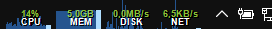

# system-watch-band
DeskBand with monitoring charts (CPU and memory) for Windows

This app shows some cool graphs displaying CPU and memory usage on the taskbar (as a Desk Band).

This project was made using the  [CS DeskBand](https://github.com/dsafa/CSDeskBand) library.